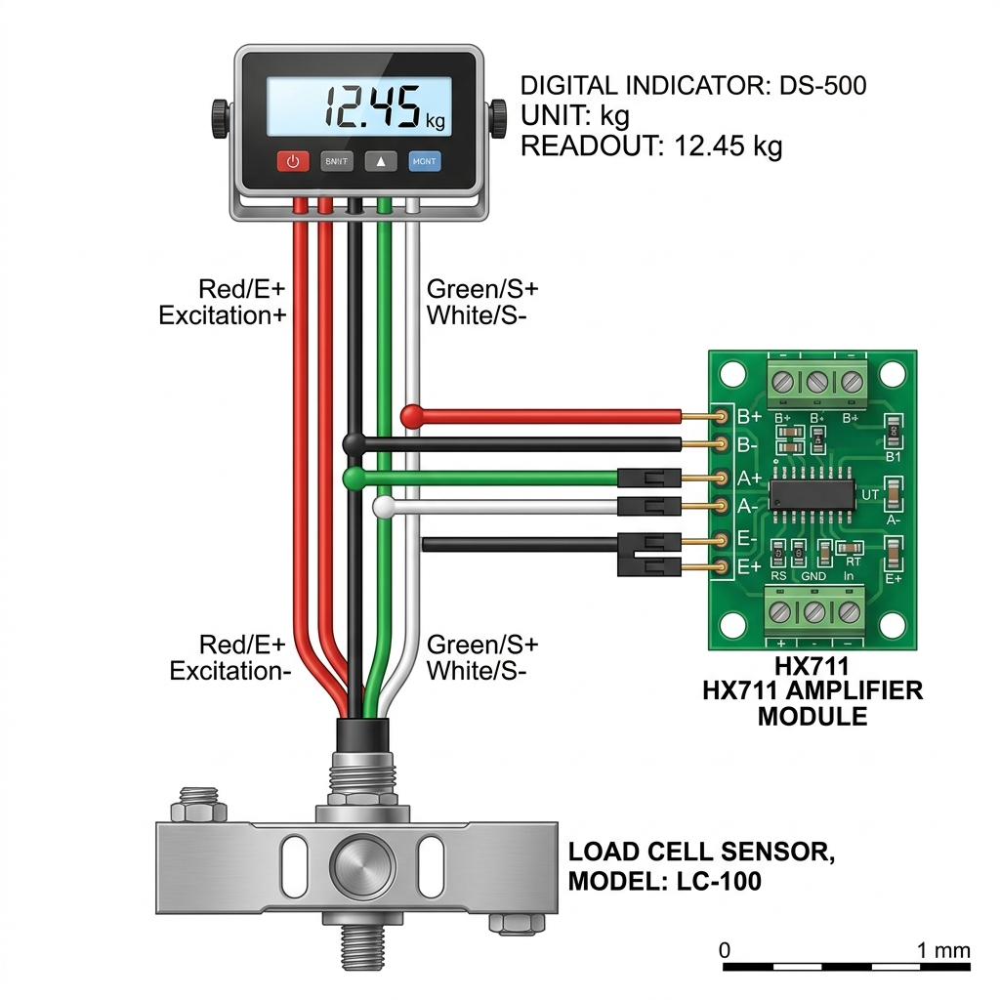
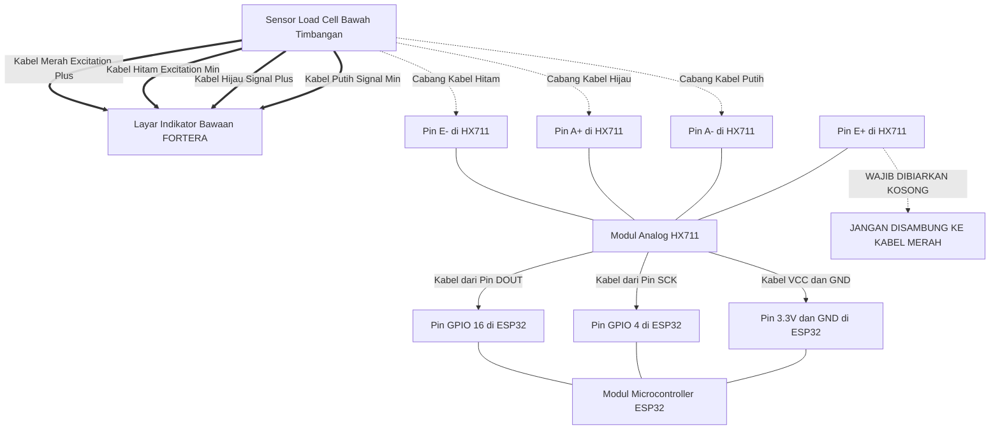

# Panduan & Skema Wiring Hybrid (Timbangan FORTERA + ESP32)

Dokumen ini berisi panduan lengkap tentang bagaimana menyambungkan timbangan komersial digital (seperti FORTERA 500kg) agar dapat memunculkan angka di layar bawaan pabrik **sekaligus** mengirimkan data ke sistem IoT ESP32 secara bersamaan (*Hybrid*).

---

## 1. Diagram Skema Kabel (Wiring Diagram)

Berikut adalah ilustrasi penyambungan kabel (*tapping* / pencabangan) menggunakan format diagram. Garis tebal adalah kabel asli pabrik, sedangkan garis putus-putus adalah kabel tambahan yang Anda sambungkan ke modul HX711.

---

## 2. Langkah-Langkah Pengerjaan (Step-by-Step)

### A. Persiapan Kabel Sensor
1. Buka leher/tiang penyangga layar timbangan FORTERA atau urutkan kabel tebal yang berasal dari pelat bawah timbangan menuju ke layar atas.
2. Temukan bagian kabel yang bisa dikupas pelindung luarnya (karet tebalnya) tanpa memotong kabel kawat di dalamnya.
3. Anda akan melihat 4 kabel kecil berwarna: **Merah, Hitam, Hijau, Putih**.

### B. Proses Suntik / Cabang Kabel (Tapping)
Gunakan silet atau *wire stripper* untuk mengupas sedikit saja (sekitar 0.5 cm) kulit luar kabel **Hitam, Hijau, dan Putih**. 
> **Peringatan:** Biarkan kabel **Merah** utuh! Jangan dikupas, dan jangan dicabang. Kabel merah ini menyalurkan listrik dari FORTERA ke sensor.

Sambungkan kabel *jumper* (kabel tambahan) ke bagian yang telah dikupas tadi, lalu solasi/bungkus dengan selotip bakar agar tidak korslet.
1. Sambungkan ujung kabel *jumper* dari kabel **Hijau** ➔ ke lubang pin **A+** pada HX711.
2. Sambungkan ujung kabel *jumper* dari kabel **Putih** ➔ ke lubang pin **A-** pada HX711.
3. Sambungkan ujung kabel *jumper* dari kabel **Hitam** ➔ ke lubang pin **E-** (GND) pada HX711.
4. Pastikan lubang pin **E+** pada HX711 benar-benar **KOSONG**.

### C. Sambungan HX711 ke ESP32
Sesuai dengan kode *firmware* `main.cpp` yang telah dibuat, sambungkan HX711 ke ESP32 Anda:
- Pin **VCC** HX711 ➔ ke Pin **3V3** (3.3V) ESP32
- Pin **GND** HX711 ➔ ke Pin **GND** ESP32
- Pin **DT / DOUT** HX711 ➔ ke Pin **D16 / GPIO 16** ESP32
- Pin **SCK** HX711 ➔ ke Pin **D4 / GPIO 4** ESP32

---

## 3. Syarat Sistem Hybrid Berjalan
1. **Layar Utama Wajib ON:** Karena kabel Merah (sumber daya sensor) hanya dialiri listrik oleh mesin timbangan FORTERA, maka modul ESP32 baru bisa membaca berat **HANYA JIKA** layar FORTERA dihidupkan (ON).
2. **Ulangi Proses Kalibrasi di ESP32:** Menambahkan kabel bercabang akan memberikan nilai hambatan (*resistance*) tambahan yang sangat kecil. Walaupun kecil, hal ini mengubah nilai pembacaan analog. Oleh karena itu, Anda harus mengkalibrasi ulang nilai `CALIBRATION_FACTOR` di kode `main.cpp` ESP32 Anda agar angkanya cocok dengan layar FORTERA.
