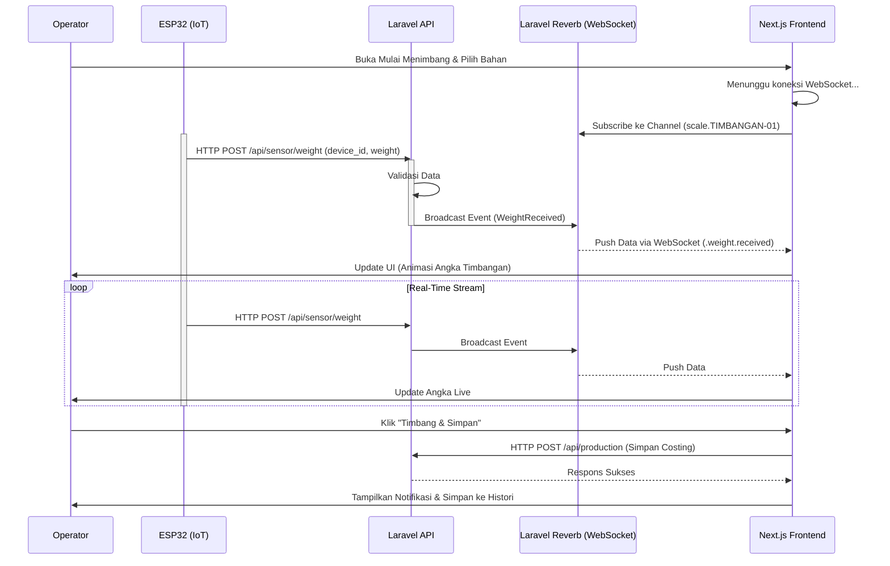
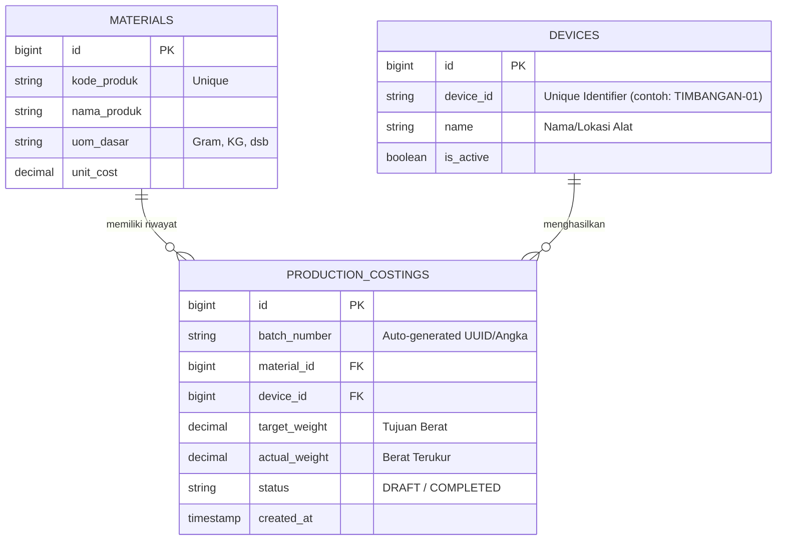
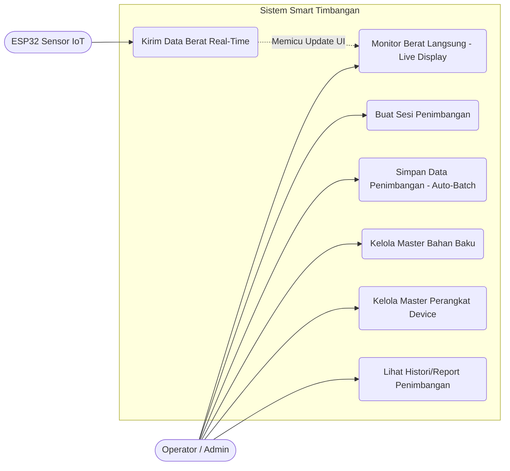

# Diagram UML & Alur Sistem

Dokumen ini memuat diagram UML dan representasi visual dari arsitektur serta alur kerja sistem **Smart Timbangan IoT**. Seluruh diagram di bawah ini menggunakan format teks [Mermaid](https://mermaid.js.org/) yang dapat di-*render* secara langsung di platform berbasis Markdown seperti GitHub, GitLab, atau IDE yang mendukung ekstensi Markdown.

---

## 1. Sequence Diagram: Alur Penimbangan Real-Time

Diagram ini mengilustrasikan bagaimana data berat mengalir dari perangkat keras (ESP32) hingga diperbarui secara langsung di peramban pengguna tanpa proses *refresh*.



---

## 2. Activity Diagram: Alur Kerja Operator (Direct Batching)

Diagram alur (*flowchart*) berikut memodelkan tahapan yang dilakukan oleh operator dalam keseharian produksi.

```mermaid
flowchart TD
    A[Mulai] --> B{Pilih Menu Dashboard}
    
    B -->|Bahan Baku| C[Manajemen Bahan (CRUD)]
    B -->|Perangkat| D[Manajemen ESP32 (CRUD)]
    B -->|Produksi| E[Buka Mulai Menimbang]
    
    E --> F[Klik + Buat Sesi Baru]
    F --> G[Pilih Bahan Baku dari Dropdown]
    G --> H[Monitor Live Weight]
    
    H --> I{Apakah Timbangan Sesuai Target?}
    I -- Tidak --> H
    
    I -- Ya --> J[Klik Timbang dan Simpan]
    J --> K[Sistem Mem-generate Batch Code (Costing)]
    K --> L[Data Tersimpan di Database]
    L --> M[Sesi Selesai / Lanjut Penimbangan Baru]
    
    M --> N[Selesai]
```

---

## 3. Entity Relationship Diagram (ERD) / Class Diagram

Diagram di bawah ini menunjukkan struktur relasional basis data yang menghubungkan perangkat keras, bahan baku, dan riwayat penimbangan (Production Costing).



---

## 4. Use Case Diagram

Gambaran *Use Case* sistem yang mendeskripsikan peran aktor (Operator & IoT) terhadap fungsionalitas aplikasi.


